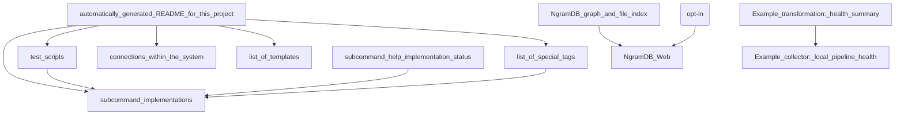

```mermaid
graph TD;
  test_scripts --> subcommand_implementations;
  automatically_generated_README_for_this_project --> subcommand_implementations;
  automatically_generated_README_for_this_project --> test_scripts;
  automatically_generated_README_for_this_project --> connections_within_the_system;
  automatically_generated_README_for_this_project --> list_of_templates;
  automatically_generated_README_for_this_project --> list_of_special_tags;
  subcommand_help_implementation_status --> subcommand_implementations;
  list_of_special_tags --> subcommand_implementations;
  NgramDB_graph_and_file_index --> NgramDB_Web;
  Codex_task_worker_(opt-in) --> NgramDB_Web;
  Example_transformation:_health_summary --> Example_collector:_local_pipeline_health;
```
